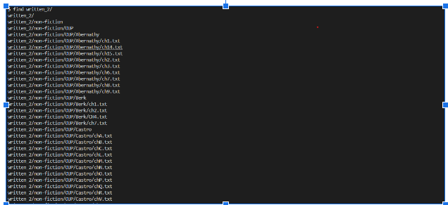
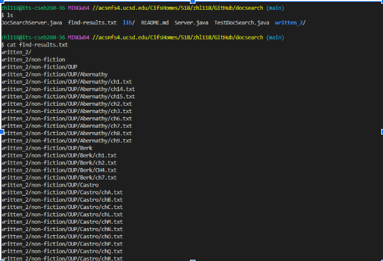
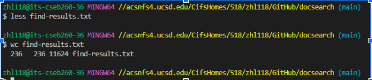
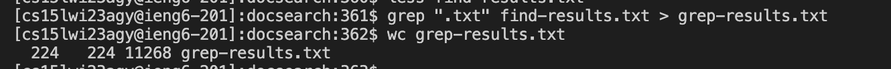
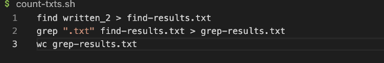
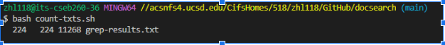
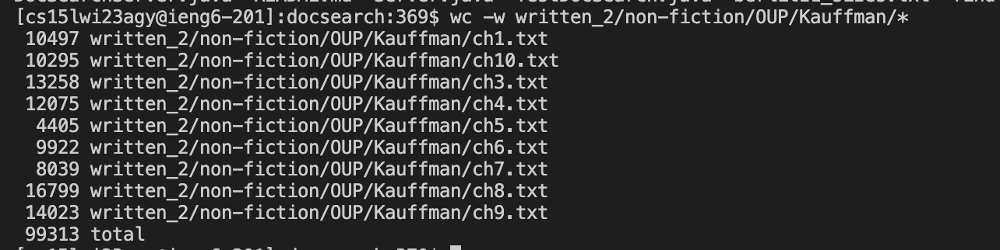
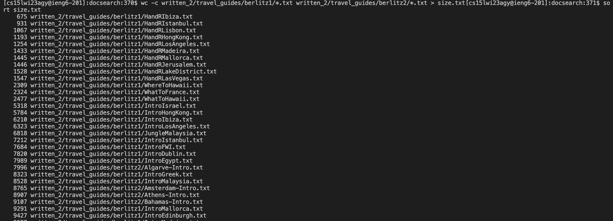
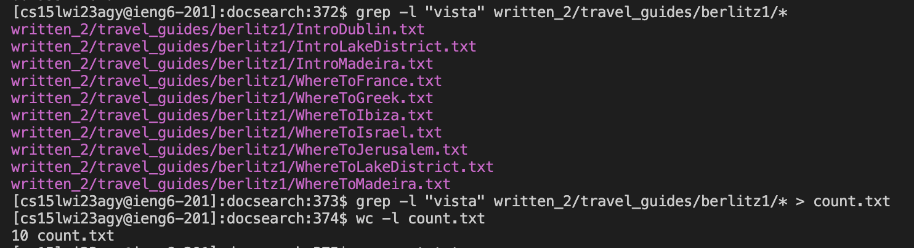

*Lab Report3*

In this week, we tried a lot search command that based on git bash

*First Part*
we used *find <>* command to take a directory path as an argument and list files and directories inside that directory. and using the output redirection *>* we
will see a result file in the director

and if we use the cat command we will see a lot files which we don't want to see here, so another command we used is *less <>*

Then we want to see how many text files are there?

here we use *wc find-results.txt*

But this is wrong answer. 

In this Lab we will use the *grep* command to solve this problem

we can also showing this by using create a sh file called *count-txts.sh* and run the command *$ bash count-txts.sh*

*Command-Line-Options*
First we want to find What is the file with the fewest words in written_2/non-fiction/OUP/Kauffman/

We can use the command-line-option *-w*

we found out Chapter 5 has fewest words with 4405, In other word we also can use *-w* options to find most words of txt file in that direction

If we want to find What is the file with the most characters?

We can use *-c*

Then we put all results with line numbers in a txt file, after we sort that file The first line shows the file contains the fewest characters txt file,we can simply scroll down to the last file that is most character txt file.

*How many lines in berlitz1 contain the string "vista"? *

We can use *-l* options to *grep* list files or arguments without taking other action.

*Conclusion*

In this lab, we find some useful command to sort and search word or specific file in a director. Some will let us quikly to get result but i have to really careful to use command because different command may give you the wrong answer
