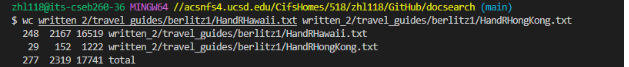

*Lab Report3*

In this week, we tried a lot search command that based on git bash

*First Part*
we used *find <>* command to take a directory path as an argument and list files and directories inside that directory. and using the output redirection *>* we
will see a result file in the director

and if we use the cat command we will see a lot files which we don't want to see here, so another command we used is *less <>*

Then we want to see how many text files are there?

here we use *wc find-results.txt*

But this is wrong answer. The simplest way is use *grep* with the specific content.

I'm showing this by using create a sh file called *count-txts.sh* and run the command *$ bash count-txts.sh*

*Second Part*

We are counting how many total words are in written_2/non-fiction/OUP/Abernathy/

*Conclusion*

In this lab, we find some useful command to sort and search word or specific file in a director. Some will let us quikly to get result but i have to really careful to use command because different command may give you the wrong answer
